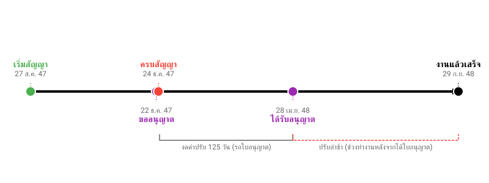

# เรียนรู้จากคำพิพากษา EP.13: ถูกปรับเละเพราะ "ยังไม่ขออนุญาตกรมทาง" ศาลสั่งคืนเงินค่าปรับ!

**บทเรียนจากคำพิพากษาศาลปกครองสูงสุดที่ อ. ๔๑๓/๒๕๕๕**

หนึ่งในปัญหาคลาสสิกของงานก่อสร้างประปาหรือวางท่อ คือต้องผ่าน **"เขตทางหลวง"** ซึ่งต้องขออนุญาตก่อน แต่ความผิดพลาดที่พบบ่อยคือ "เซ็นสัญญาไปแล้ว แต่ใบอนุญาตยังไม่มา"

คดีนี้เป็นอุทาหรณ์ชั้นดี เมื่อ อบต. สั่งปรับผู้รับเหมาเป็นเงินนับล้านบาท โดยอ้างว่าถึงจะยังไม่มีใบอนุญาตดันท่อลอดถนน แต่ผู้รับเหมาก็ควรไปทำงานส่วนอื่นก่อนสิ! ข้ออ้างนี้ฟังขึ้นหรือไม่? ศาลตัดสินอย่างไร? มาดูกันครับ

---

## 🚧 เหตุการณ์จริง

**โครงการ:** ก่อสร้างโรงสูบน้ำและวางระบบท่อประปาหมู่บ้าน มูลค่า 3.9 ล้านบาท
**เงื่อนไข:** สัญญา 120 วัน ต้องแล้วเสร็จวันที่ 24 ธ.ค. 2547
**จุดเกิดเหตุ:**
แบบก่อสร้างกำหนดให้ **"ดันท่อลอดถนน"** ในเขตทางหลวง 2 จุด ซึ่งตามกฎหมายต้องได้รับอนุญาตจากกรมทางหลวงก่อน

**ไทม์ไลน์ความผิดพลาด:**
*   **เริ่มสัญญา:** 27 ส.ค. 47
*   **ผู้ว่าจ้างยื่นขออนุญาต:** 22 ธ.ค. 47 (**ก่อนสัญญาหมดอายุแค่ 2 วัน!**)
*   **ได้รับอนุญาตจริง:** 28 เม.ย. 48 (เลยกำหนดส่งงานไป 4 เดือนกว่า)

**การลงโทษ:**
อบต. สั่งปรับผู้รับเหมาฐานส่งงานล่าช้า 279 วัน เป็นเงิน **1,115,721 บาท** โดยให้เหตุผลว่า:
> *"ถึงจะยังดันท่อลอดไม่ได้ แต่ผู้รับเหมาก็ไปทำวางท่อส่วนอื่น (แผนงานหลัก) รอได้นี่นา ไม่เห็นต้องหยุดงานเลย ถือว่าละทิ้งงานเอง"*

---

## ⚖️ คำวินิจฉัยศาลปกครองสูงสุด

ศาลพิพากษาให้ **"คืนเงินค่าปรับ"** แก่ผู้รับเหมา จำนวน 499,875 บาท (คืนเฉพาะส่วนวันที่ล่าช้าเพราะรอใบอนุญาต) โดยให้เหตุผลที่ฟาดฟันข้ออ้างของราชการได้อย่างเฉียบขาด:

### 1. หน้าที่ของ "ผู้ว่าจ้าง" ต้องพร้อม
ศาลมองว่า หน่วยงานราชการควรต้องรู้แต่แรกแล้วว่างานนี้ต้องขออนุญาตกรมทางหลวง จึง **"ควรเตรียมความพร้อมให้เรียบร้อยก่อน"** แล้วค่อยให้เอกชนเข้ามาทำสัญญา
การส่งมอบพื้นที่ที่ยังมีอุปสรรคทางกฎหมาย (เข้าทำไม่ได้เพราะผิด พ.ร.บ.ทางหลวง) ถือเป็น **"ความผิดและความบกพร่องของฝั่งผู้ว่าจ้าง"** เต็มๆ

### 2. จะให้ "ลักไก่" หรือ "ทำงานข้ามขั้นตอน" ไม่ได้
ข้ออ้างที่ว่า *"ให้ไปทำงานส่วนอื่นก่อน"* ศาลมองว่า:
*   การให้ผู้รับเหมาเข้าไปทำงานในเขตทางหลวงก่อนได้รับอนุญาต = **บีบบังคับทางอ้อมให้เอกชนทำผิดกฎหมาย** (พ.ร.บ. ทางหลวง)
*   หากให้วางท่อส่วนอื่นมารอไว้ก่อน แล้วภายหลังกรมทางหลวง **"ไม่อนุญาต"** หรือให้เปลี่ยนจุดดันท่อลอด แนวท่อที่วางไว้อาจเสียหายและต้องรื้อใหม่ทั้งหมด ทำให้เกิดความเสี่ยงที่ผู้รับเหมาไม่ควรต้องแบกรับ

### 3. สิทธิ์ในการขยายเวลา
เมื่อเหตุล่าช้าเกิดจากความบกพร่องของหน่วยงานรัฐ (ขออนุญาตช้า) ผู้รับเหมาจึงมีสิทธิ์ได้รับการ **"ขยายเวลาก่อสร้าง"** เท่ากับวันที่เสียไป (ช่วงที่รอใบอนุญาต) ตามระเบียบพัสดุฯ
การที่ อบต. ปฏิเสธไม่ยอมขยายเวลาให้ และเดินหน้าปรับเต็มจำนวน จึงเป็นการกระทำที่ไม่ชอบด้วยกฎหมาย

---

## 💡 บทสรุปและข้อคิด

### สำหรับหน่วยงานเจ้าของโครงการ
1.  **ขออนุญาตก่อนเซ็น:** งานใดที่ต้องใช้พื้นที่หน่วยงานอื่น (ทางหลวง, รถไฟ, ชลประทาน) **ต้อง** ดำเนินการขออนุญาตให้จบ หรืออย่างน้อยต้องแน่ใจว่าได้แน่ๆ ก่อนเริ่มสัญญา อย่าไปลุ้นเอาดาบหน้า
2.  **รับผิดชอบความล่าช้า:** ถ้าขออนุญาตไม่ทันจริงๆ ต้องยอมรับสภาพว่าต้อง "งดค่าปรับ" หรือ "ขยายเวลา" ให้ผู้รับเหมา อย่าผลักภาระด้วยตรรกะว่า "ทำอย่างอื่นรอไปก่อน" เพราะศาลไม่รับฟัง

### สำหรับผู้รับจ้าง
1.  **อย่าเสี่ยงทำผิดกฎหมาย:** ถ้าเจ้าของงานสั่งให้เข้าไปทำในพื้นที่ที่ยังไม่ได้ใบอนุญาต **"ต้องทำหนังสือท้วงติง"** อย่าเพิ่งลงมือทำ เพราะถ้าโดนจับข้อหาบุกรุกเขตทางหลวง เราจะโดนก่อน
2.  **สงวนสิทธิ์ขยายเวลาทันที:** เมื่อรู้ว่าใบอนุญาตยังไม่ได้ ให้ทำหนังสือแจ้งขอสงวนสิทธิขยายสัญญาไว้เป็นหลักฐานทันทีที่เกิดเหตุ (ภายใน 15 วัน) เพื่อใช้สู้คดีในอนาคต

---

---

## 📌 ข้อสังเกตเพิ่มเติม: ทำไมศาลไม่คืนค่าปรับให้ทั้งหมด?

ศาลสั่งคืนค่าปรับ (ขยายเวลา) ให้ **เฉพาะช่วง 125 วัน** ที่รอใบอนุญาตเท่านั้น (25 ธ.ค. 47 - 28 เม.ย. 48) แต่ **ไม่รวม** เวลาทำงานหลังจากได้รับใบอนุญาตแล้ว (อีก 5 เดือน) เพราะ:
1.  **ยึดตามความผิดของรัฐ:** ศาลมองว่า อบต. ผิดจริงแค่ช่วงที่ "ไม่มีใบอนุญาต" เมื่อได้ใบอนุญาตแล้ว ความรับผิดชอบกลับมาที่ผู้รับจ้าง
2.  **เวลาที่เหลืออยู่:** เดิมผู้รับจ้างเหลือเวลาตามสัญญาแค่งวดสุดท้ายอีก **10 วัน** แต่หลังได้ใบอนุญาตกลับใช้เวลาทำงานจริงถึง 5 เดือน ซึ่งนานกว่าแผนเดิมมาก ศาลจึงมองว่าส่วนนี้เป็นความล่าช้าของผู้รับจ้างเอง

*สรุป: ศาลยุติธรรมตรงที่ให้ความเป็นธรรมในส่วนที่รัฐผิด แต่ก็ไม่ได้โอ๋ผู้รับจ้างจนเกินขอบเขตของสัญญาเดิมครับ*

### 💡 เกร็ดเพิ่มเติม: ทำอย่างไรถึงจะได้งดค่าปรับมากกว่านี้?
ในมุมมองของการบริหารสัญญา หากผู้รับจ้างไม่อยาก "รับสภาพ" แค่ 125 วัน ควรทำดังนี้ก่อนเริ่มงานใหม่:
1.  **ขอเวลาเตรียมการ (Remobilization):** อ้างว่าหยุดงานไปนาน ต้องรื้อฟื้นเครื่องจักร/คนงาน ขอเวลา 15-30 วัน (ที่ไม่นับเป็นวันทำงาน)
2.  **อ้างความเสียหาย (Site Recovery):** สำรวจหน้างานว่าดินสไลด์หรือท่อเสียหายหรือไม่ ขอเวลาซ่อมแซมก่อนเริ่มงานจริง
3.  **เสนอแผนงานใหม่ (Revised Schedule):** ทำแผนงานจริงเสนอให้เซ็นรับรองว่า งานที่เหลือต้องใช้เวลา 45 วัน (ไม่ใช่ 10 วันตามกระดาษ) เพื่อใช้เป็นหลักฐานขยายเวลาเพิ่ม

*อ้างอิง: คำพิพากษาศาลปกครองสูงสุดที่ อ. ๔๑๓/๒๕๕๕ (เดิมระบุเลขผิดเป็น ๒๑๓/๒๕๕๕)*
